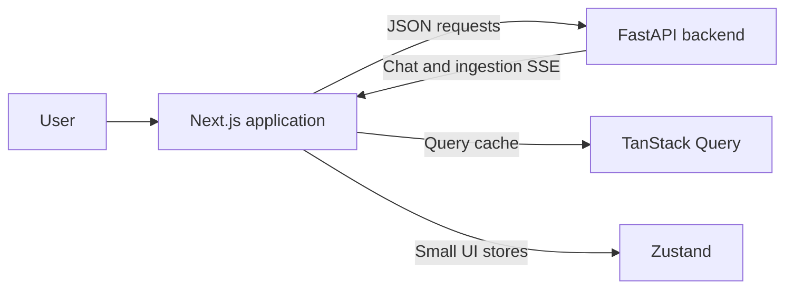
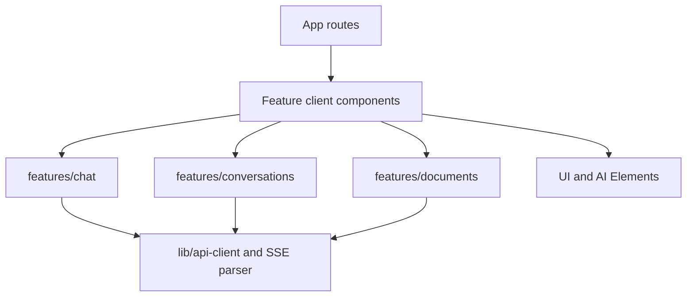
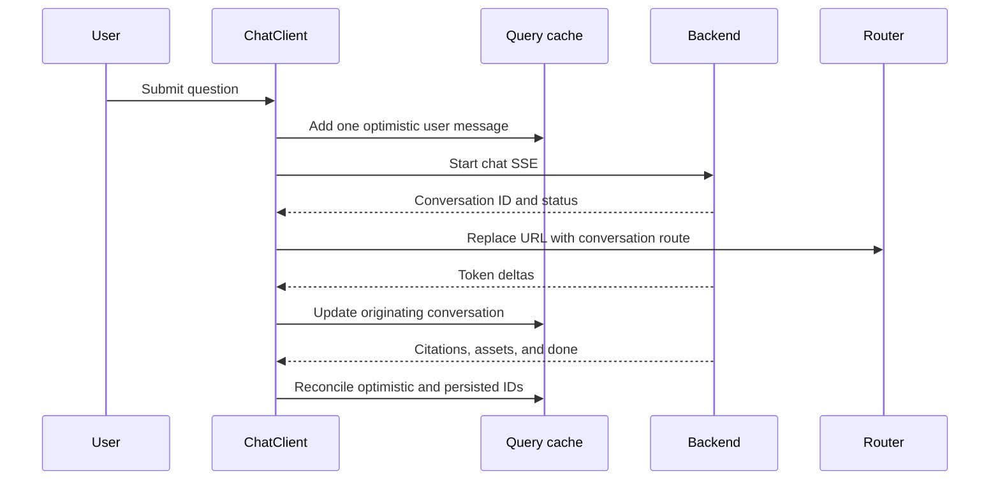
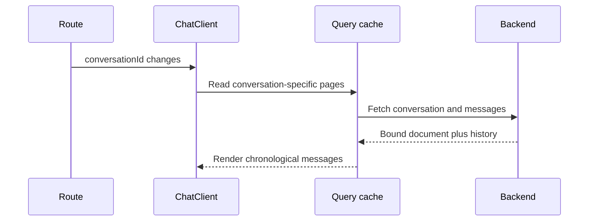
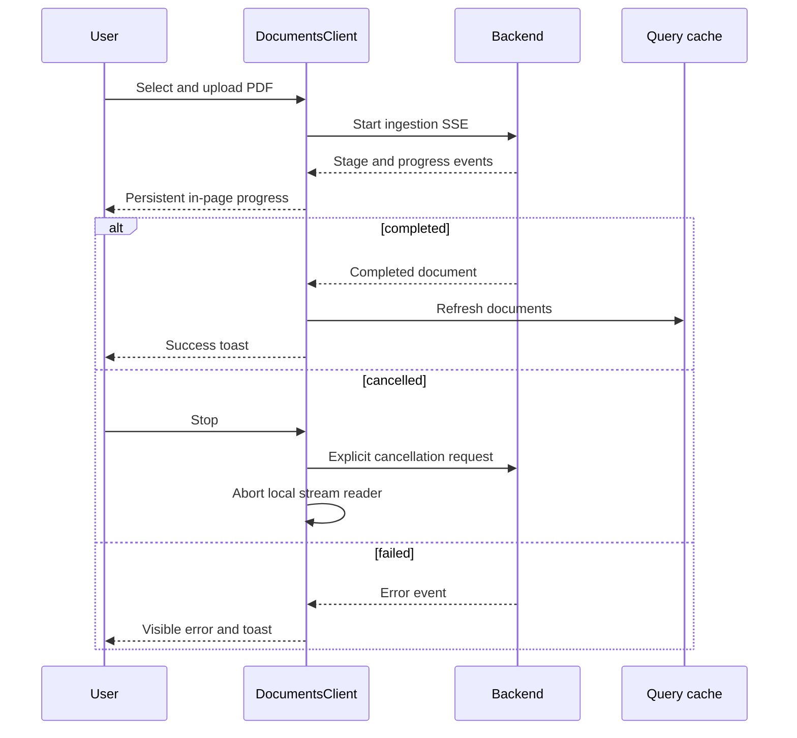

# Frontend Architecture

The Documind frontend is a Next.js App Router application organized around feature modules. It separates server state, navigation state, local UI state, and active streaming state so a conversation can keep generating while users navigate without leaking messages or document selection across chats.

## System context



The backend remains the durable source of truth. Client caches improve responsiveness but must reconcile with persisted conversations, messages, and documents.

## Route structure

```text
src/app/
├── layout.tsx
├── global-error.tsx
├── page.tsx                         # Redirects to /chat
└── (dashboard)/
    ├── layout.tsx                   # App shell and navigation
    ├── chat/
    │   ├── page.tsx                 # New chat
    │   └── [conversationId]/
    │       ├── page.tsx
    │       ├── loading.tsx
    │       └── error.tsx
    └── documents/
        ├── page.tsx
        ├── loading.tsx
        └── error.tsx
```

Server route components establish page boundaries. Interactive behavior lives in client components such as `ChatClient` and `DocumentsClient`.

## State ownership

| State | Owner | Examples |
| --- | --- | --- |
| Durable server state | Backend, mirrored by TanStack Query | documents, conversations, paginated messages |
| Route identity | Next.js router | active conversation ID, new-chat route |
| Cross-route UI preference | Zustand or provider | sidebar state, selected document seed |
| Active interaction | Feature client component | draft text, stream controller, near-bottom state |
| Theme | next-themes | light, dark, system preference |

The route conversation ID is authoritative for which conversation is displayed. A query cache entry must be keyed by conversation ID, and late stream events must update their originating conversation rather than whichever route is currently visible.

## Feature boundaries



- `features/*/api.ts` contains request functions.
- `features/*/queries.ts` defines query keys and TanStack Query options/hooks.
- `features/*/cache.ts` centralizes optimistic and stream cache updates.
- `features/*/types.ts` defines the transport and view models.
- Components compose those feature primitives into user interactions.

Transport types should remain faithful to the backend. View-model mapping is the right place to filter unsupported internal roles such as `system` when a `ChatMessage` only permits `user` and `assistant`.

## New-chat and streaming flow



Only one layer should insert the optimistic user message. When the server returns persisted history, reconciliation must use stable identifiers (or an explicit optimistic-to-server mapping) so the query does not appear twice.

Starting a new chat clears the visible route-scoped state immediately. It must not wait for a previous stream to finish. A previous request may keep running, but its events stay attached to its own conversation cache.

## Existing-conversation flow



The conversation's persisted document is authoritative in both the header and composer selector. The globally selected document is used only when starting a new conversation. Availability is determined by matching the persisted document identity against the documents query; display-name differences must not incorrectly disable chat.

## Infinite history and scrolling

The message list loads older cursor pages when the user reaches the top. Before prepending, it records scroll height and restores the relative viewport afterward.

Scroll policy:

- When a response starts, reveal the submitted user message with space above the fixed composer.
- While tokens arrive, follow output only if the user is near the bottom.
- Once the user scrolls upward, do not force the viewport down.
- Show a return-to-latest control when unread content is below.
- Keep the composer in the layout's fixed/sticky bottom region; message height must never recenter it.

## Assistant response composition

```text
AssistantMessage
├── AnswerContent          # Streamdown markdown and code rendering
├── MessageActions         # Timestamp, copy, retry, regenerate
├── CitationAccordion      # Grouped source evidence
├── FigureGallery          # Responsive thumbnails
│   └── FigurePreviewDialog
└── TableGallery           # Horizontally scrollable tables
```

Vercel AI Elements provide the conversational primitives and Streamdown renders generated content. Application-specific wrappers own citations, document metadata, retry semantics, and visual consistency.

Failed and stopped responses retain a normal message-width container. They should not collapse into unbounded inline error text, and they must expose the appropriate retry action.

## Document ingestion flow



Aborting `fetch` only stops the browser reader. The explicit cancellation endpoint is required to stop server-side pipeline work.

## Cache consistency rules

1. Query keys include the entity identity and pagination inputs.
2. Optimistic sidebar changes snapshot previous data and roll back on failure.
3. Stream handlers capture their conversation ID; they never derive it from the current URL after starting.
4. Persisted messages replace matching optimistic entries rather than being appended blindly.
5. Conversation deletion removes detail and message caches and updates every affected list page.
6. Document deletion invalidates document lists and re-evaluates availability for bound conversations without removing historical answers.

## Design system and responsiveness

The root layout loads Manrope for interface text and Newsreader for selective editorial accents. Theme values use semantic CSS variables so the same component hierarchy works in light and dark modes. `next-themes` owns user preference and system synchronization; theme-dependent rendering waits until hydration where necessary.

The desktop sidebar becomes a drawer on narrow screens. The composer, document selector, dialogs, code blocks, tables, and galleries are designed down to 320 px. Wide generated content scrolls inside its own container rather than increasing page width.

## Feedback and errors

- Sonner toasts communicate completed actions such as rename, delete, upload, and copy.
- Progress stays visible in the relevant page.
- Blocking document or conversation errors render inline.
- Segment `error.tsx` files provide retryable route boundaries.
- `global-error.tsx` handles failures above the dashboard segments.

## Extension guide

- Add backend operations in the relevant `features/<name>/api.ts`, then expose cached access through `queries.ts`.
- Add generated-response UI by composing existing AI Elements rather than duplicating markdown or prompt primitives.
- Add a new dashboard page below the route group so it inherits the app shell.
- Keep document-specific behavior keyed by immutable document identity, not a title or filename alone.
- Keep long-running operation cancellation explicit at both client and server layers.

## Verification strategy

Automated checks begin with `npm run lint` and `npm run build`. High-value browser scenarios include:

1. Submit a first question and verify only one optimistic user message appears.
2. Navigate to new chat and another conversation while a response streams, then return and verify the query and response remain attached to the original chat.
3. Switch between conversations bound to different documents and verify header/composer metadata changes correctly.
4. Cancel ingestion and verify backend processing stops and the record becomes actionable.
5. Delete a document and verify historical conversation content remains while new submission is disabled only for that document.
6. Test 320, 375, 768, and 1024 px viewports in light, dark, and system themes.
