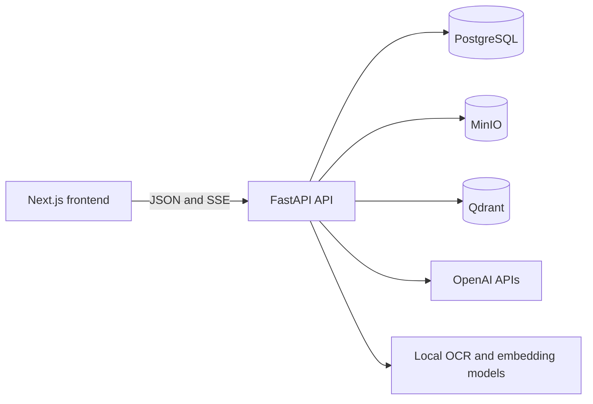
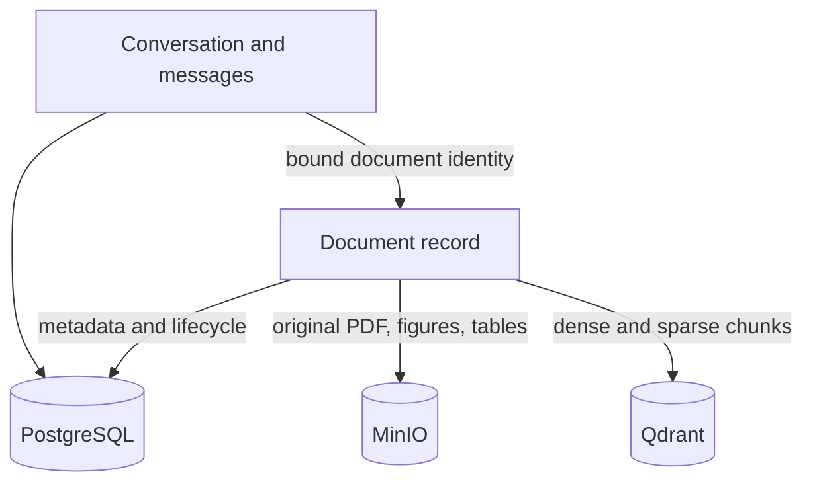
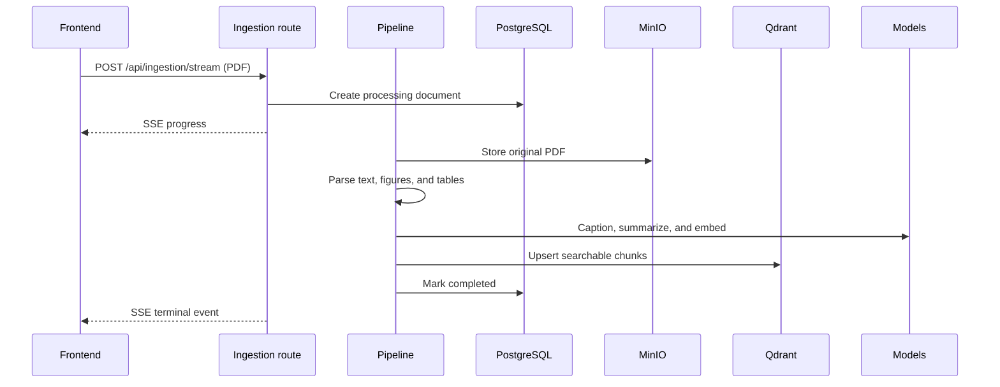
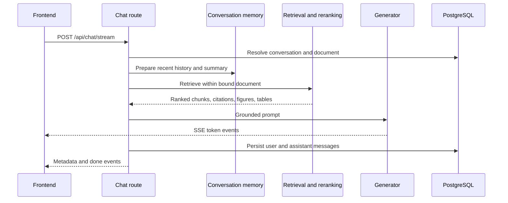
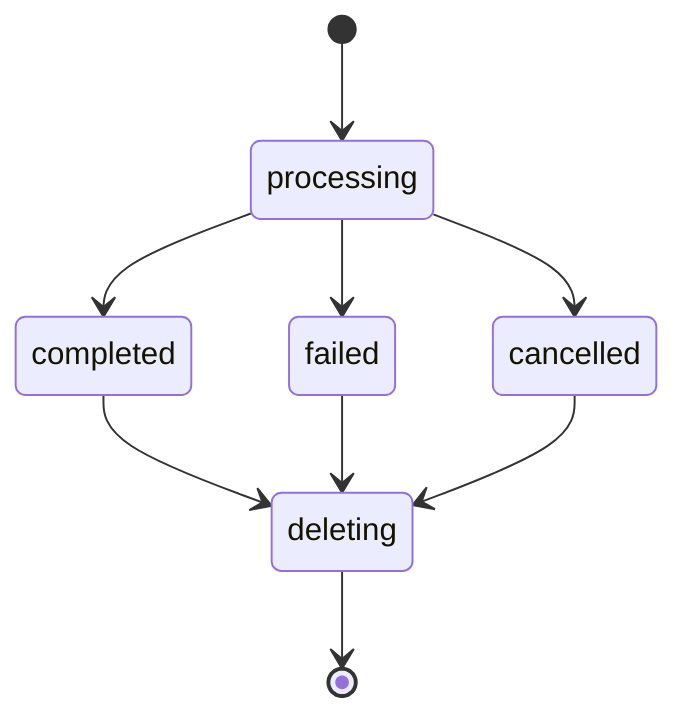

# Backend Architecture

This document describes the runtime architecture of the Documind backend. The backend is a modular FastAPI application with three durable stores: PostgreSQL for application state, MinIO for binary assets, and Qdrant for searchable document representations.

## System context

The API is intentionally responsible for orchestration. Parsing, enrichment, retrieval, persistence, and generation live behind focused modules rather than inside route handlers.

## Layer boundaries

| Layer | Location | Responsibility |
| --- | --- | --- |
| Transport | `app/api/routes`, `app/api/schemas` | HTTP validation, status codes, JSON, and SSE framing |
| Orchestration | `app/services` | Coordinates ingestion, documents, chat, memory, and persistence |
| Document pipeline | `app/parser`, `preprocessing`, `enrichment`, `chunking` | Turns a PDF into structured, enriched chunks |
| Retrieval pipeline | `app/embedding`, `retrieval`, `reranking`, `vectorstore` | Creates vectors and returns ranked evidence |
| Generation | `app/generation`, `app/llm` | Builds grounded prompts and streams model output |
| Persistence | `app/repositories`, `app/db` | Stores documents, conversations, summaries, and messages |
| Object storage | `app/storage` | Stores PDFs and extracted binary assets in MinIO |
| Configuration | `app/config.py` | Loads environment configuration and establishes data directories |

Routes should remain thin: validate input, acquire dependencies, invoke a service, and translate the result into HTTP or SSE output.

## Durable data ownership

- **PostgreSQL** is the source of truth for document lifecycle, conversation identity, titles, messages, and memory summaries.
- **MinIO** owns the original upload and derived binary assets. PostgreSQL and Qdrant retain paths or references, not copies of binary data.
- **Qdrant** owns retrieval-oriented chunk payloads and vectors. Its records are scoped to a document so queries and deletion cannot cross document boundaries.

A conversation becomes bound to its source document when it is created. Later UI document selection must not change that binding.

## Ingestion flow

The pipeline emits coarse stages and progress updates while work proceeds. A successful terminal transition makes the document selectable for chat. Failure records the error state and must not advertise the document as ready.

### Cancellation contract

`POST /api/ingestion/{document_id}/cancel` records cancellation and signals active work. Every expensive stage must check cancellation before starting and before committing output. Cancellation is terminal: downstream stages must not continue, and partial Qdrant/MinIO data should be cleaned up or made unreachable.

Cancellation is different from a client disconnect. The frontend should call the endpoint explicitly before aborting its local stream, because terminating an HTTP reader alone does not guarantee server work has stopped.

## Chat flow

The persisted conversation document is authoritative. A request must not silently substitute the globally selected or most recently uploaded document for an existing conversation.

### Conversation memory

Conversation memory combines a bounded recent-message window with persisted summary context. `CONVERSATION_HISTORY_LIMIT` controls the immediate history size. The service boundary returns a typed memory context to the chat service; changes to that type must be updated at both construction and consumption sites.

### Streaming event policy

SSE is used for long-running ingestion and chat because it supports ordered incremental events over a normal HTTP response. Event payloads should be JSON and fall into these categories:

- status or progress
- generated token/content delta
- structured metadata such as conversation ID, citations, figures, and tables
- terminal completion, cancellation, or error

Exactly one terminal outcome should be emitted. Errors after the response has opened are represented as stream events rather than a new HTTP status.

## Conversation and message history

Messages are returned newest-page-first at the transport boundary with cursor pagination. The frontend maps them into chronological display order and preserves scroll position while prepending older pages. System messages are internal context and should either be filtered by the backend contract or deliberately handled by the frontend mapper; they are not ordinary chat bubbles.

## Document lifecycle

Deletion coordinates all stores: remove or invalidate vector points, remove object assets, then remove application metadata. A conversation may outlive its document so historical messages remain readable; only new grounded questions are disabled for that conversation.

## Failure handling

- Validation failures use normal HTTP error responses before streaming begins.
- Pipeline and model failures become a failed document or message state plus an SSE error event.
- Stale `processing` records are reconciled when documents are listed so abandoned work does not remain indefinitely active.
- Retry/regenerate creates a new generation attempt without duplicating the visible user message.
- Repository operations should be idempotent where cancellation and cleanup can race.

## Startup and lifecycle

`app/main.py` creates missing SQLAlchemy tables during FastAPI lifespan startup and disposes the async engine on shutdown. Routers are mounted under `/api`. Local CORS allows the frontend at `http://localhost:3000`.

For production, schema evolution should move from startup table creation to explicit migrations, CORS should be environment-driven, and background ingestion should move to a durable worker queue.

## Extension points

- Add a model provider behind `app/llm` without changing routes.
- Add a parser or file type behind the document pipeline and preserve the normalized element contract.
- Tune retrieval or reranking inside their modules while keeping citation metadata stable.
- Add a durable job queue by moving pipeline execution out of the ingestion route while retaining SSE progress delivery.
- Add authentication at the transport boundary and propagate tenant/user scope into every repository, object path, and Qdrant filter.

## Verification strategy

Current tests cover conversation schemas and memory. New work should add:

1. Unit tests for parsing normalization, cancellation checks, memory construction, and message mapping.
2. Repository integration tests against PostgreSQL.
3. Multi-store ingestion tests against PostgreSQL, MinIO, and Qdrant.
4. SSE contract tests for successful, failed, stopped, and disconnected streams.
5. End-to-end tests proving document isolation between conversations.
