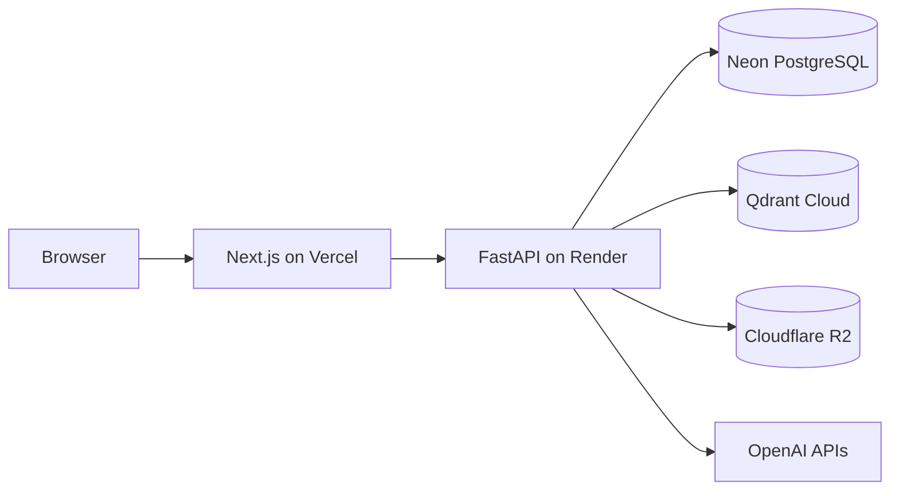

# Production Deployment

This guide deploys FastAPI to Render with Neon PostgreSQL, Qdrant Cloud, and
Cloudflare R2. Deploy the Next.js application to Vercel using the companion
frontend deployment guide.

## Architecture



## 0. Rotate exposed credentials

The former local `.env.prod` contained plaintext credentials. Revoke its
OpenAI key and rotate any password or storage credential copied from that file
before deploying. Never upload dotenv files or commit them to Git.

## 1. Neon PostgreSQL

1. Create a Neon project and database.
2. Copy the pooled connection string from the Connect dialog.
3. Keep `sslmode=require`. The backend converts `postgresql://` to the
   `postgresql+asyncpg://` dialect, maps `sslmode` to `ssl`, and removes the
   unsupported `channel_binding` connection parameter.
4. Save the complete string as Render's `DATABASE_URL` secret.

The application currently creates missing tables at startup. Introduce Alembic
migrations before changing the schema of a live database.

## 2. Qdrant Cloud

1. Create a cluster near the chosen Render region.
2. Create a database/cluster API key, not a Cloud management key.
3. Save the HTTPS cluster endpoint as `QDRANT_URL` and the key as
   `QDRANT_API_KEY` in Render.
4. Do not enable IP restrictions unless the Render service has a stable
   outbound IP.

The backend creates its collection on the first ingestion.

## 3. Cloudflare R2

1. Create an R2 bucket such as `documind-documents`.
2. Create an R2 API token scoped to that bucket with Object Read & Write.
3. Record the token's Access Key ID and Secret Access Key.
4. Configure Render:

   ```dotenv
   MINIO_ENDPOINT=ACCOUNT_ID.r2.cloudflarestorage.com
   MINIO_ACCESS_KEY=R2_ACCESS_KEY_ID
   MINIO_SECRET_KEY=R2_SECRET_ACCESS_KEY
   MINIO_BUCKET=documind-documents
   MINIO_SECURE=true
   MINIO_REGION=auto
   ```

The `MINIO_*` names remain for local compatibility. The client uses the
S3-compatible protocol and connects to R2 over TLS.

## 4. Render

1. Push the backend repository to a supported Git provider.
2. Create a Render Blueprint from `render.yaml`.
3. Supply every value marked `sync: false` using
   `.env.production.example` as the checklist.
4. Set `ALLOWED_ORIGINS` to the final Vercel origin without a trailing slash,
   for example `https://documind.vercel.app`.
5. Deploy and wait for `GET /api/health` to pass.
6. Verify `GET /api/health/database` separately.

The Docker image installs Poppler and Tesseract. The Blueprint initially uses
Render's Free web-service plan so a demo can be created without billing
details. Free services sleep when idle and have tight memory/CPU limits; PDF
parsing and local cross-encoder reranking may exceed those limits. Upgrade the
service if builds, startup, or ingestion are terminated for memory usage.
Render's filesystem is ephemeral; only temporary ingestion files are local,
while durable state lives in Neon, Qdrant, and R2.

## 5. Connect Vercel

After Render assigns the API URL:

1. Set Vercel's `NEXT_PUBLIC_API_URL` to the Render origin without a trailing
   slash, such as `https://documind-api.onrender.com`.
2. Set Render's `ALLOWED_ORIGINS` to the final Vercel origin.
3. Redeploy both services after changing build-time frontend variables.

## Release verification

- `GET /api/health` and `GET /api/health/database` succeed.
- All provider endpoints use TLS.
- No secret uses a `NEXT_PUBLIC_` name.
- A PDF completes ingestion and creates Qdrant points.
- A cited figure redirects through the asset route to an R2 presigned URL.
- A chat retrieves evidence and persists its messages in Neon.
- The production Vercel URL is allowed by backend CORS.
- Provider backups, usage alerts, and billing limits are enabled.

Render and Vercel retain prior application deploys for rollback. Application
rollback does not reverse data or schema changes.
